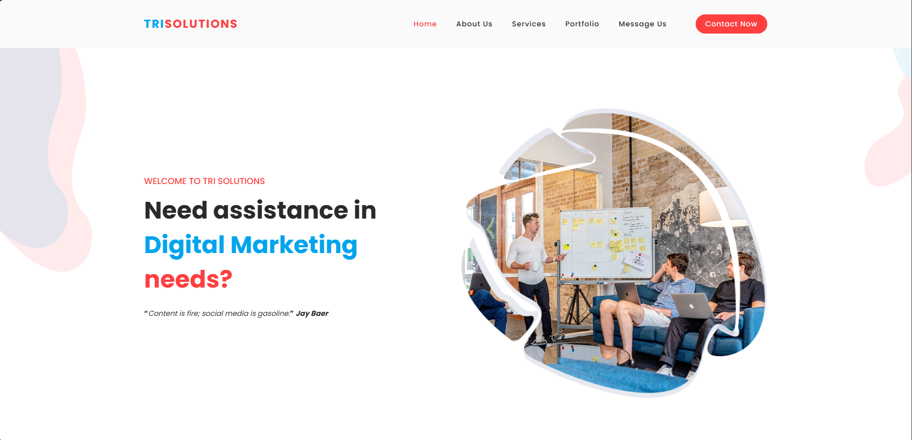

# TriSolutions Webpage

[](https://github.com/Anonym0usWork1221/Trisolutions/stargazers)
[](https://github.com/Anonym0usWork1221/Trisolutions/network/members)
[](https://github.com/Anonym0usWork1221/Trisolutions/issues)
[](https://github.com/Anonym0usWork1221/Trisolutions/watchers)
[](https://www.python.org)

## Introduction
Welcome to the **TriSolutions** webpage project. This website showcases our digital marketing services, including web development, SEO, social media management, and advertising. The site includes an interactive contact form that captures messages in the admin panel for easy management.

 *  Date   : 2024/09/28
 *  Author : **__Abdul Moez__**

 **MIT License**

## Requirements
To run this project, ensure you have **Python 3.11** or greater installed.

1. Clone the repository.
2. Navigate to the project directory.
3. Install the required packages by running:

```bash
pip install -r requirements.txt
```

## Setup

Before running the application, you need to perform database migrations to set up the necessary tables, including those required for the email form submission in the admin panel.

To migrate the database, run the following command:

```bash
python manage.py migrate
```

## Running the Application

Once the requirements are installed and the migrations are applied, you can start the development server:

```bash
python manage.py runserver 127.0.0.1:8008
```

Access the website by navigating to `http://127.0.0.1:8008/` in your web browser.

## Home Page
<p align="center">
  
</p>

## Admin Panel

All form submissions, including email contacts, are saved in the admin panel. To access the admin panel, visit `http://127.0.0.1:8000/admin/` and log in with your superuser credentials.

## Features

- **Home:** An overview of TriSolutions, including our mission and experience.
- **About Us:** Learn about our team and values.
- **Services:** A breakdown of the services we offer, such as SEO, web development, and marketing.
- **Portfolio:** View our past projects and case studies.
- **Contact:** An easy-to-use form for potential clients to reach out.
  
---
# Contributors

<a href = "https://github.com/Anonym0usWork1221/Trisolutions/graphs/contributors">
  
</a>


Buy Me a coffee
--------------
__If you'd like to show your support and appreciation for my work, you can buy me a coffee using the 
following payment option:__

**Payoneer**: `abdulmoez123456789@gmail.com`

> Your support is greatly appreciated and helps me continue providing valuable assistance and resources. 
Thank you for your consideration.
>
